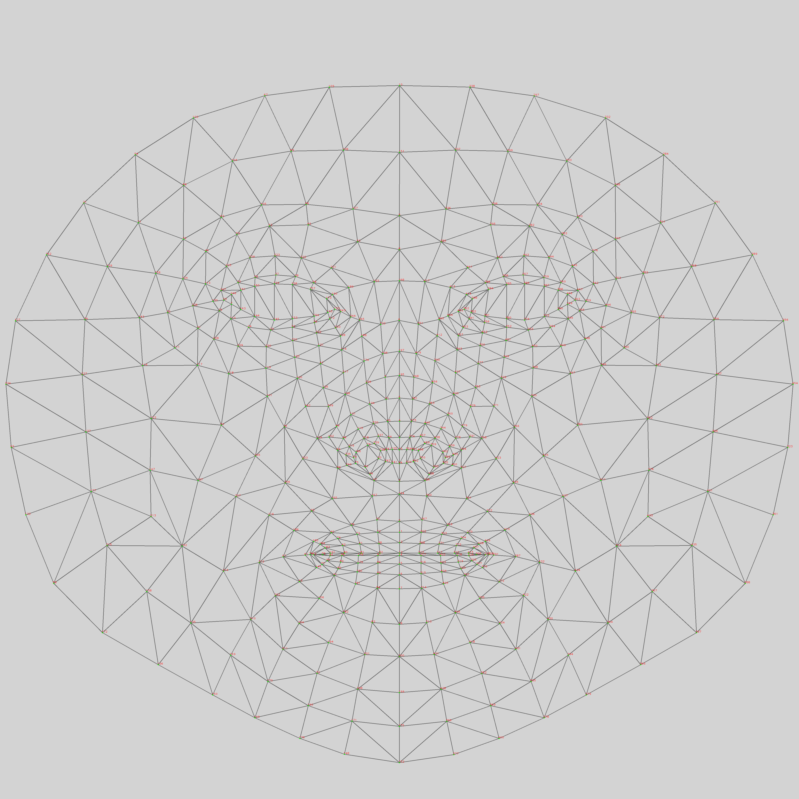
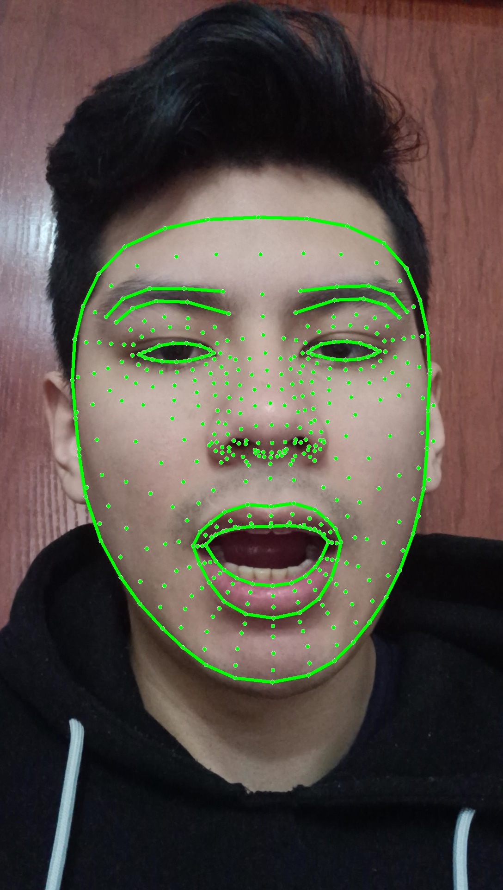
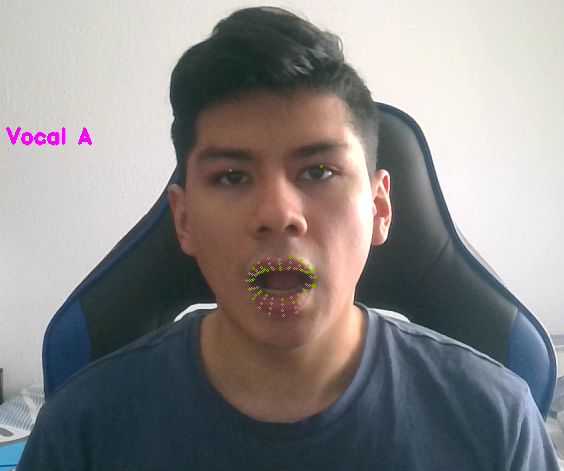
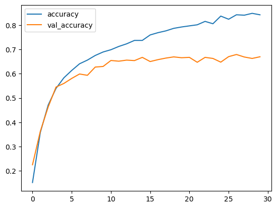
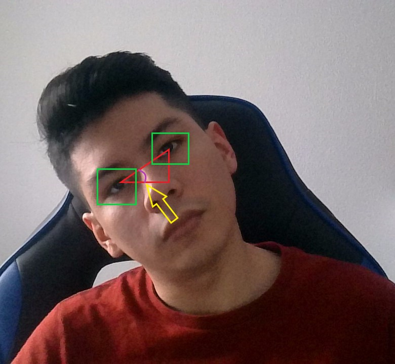
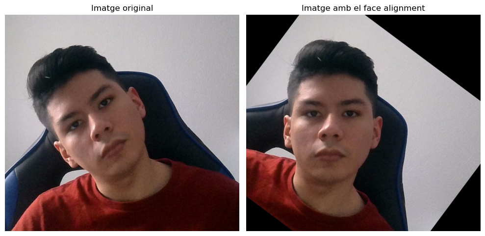
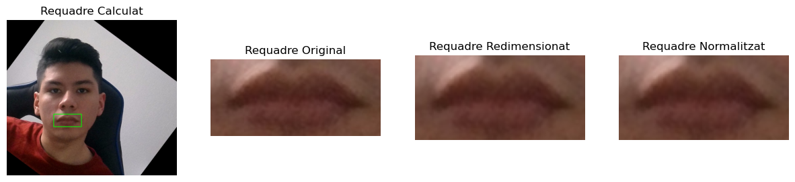

# Lip-Reading-for-Silent-Speech-Recognition-using-3D-Convolution

## Introduction
I am a student pursuing a Bachelor's degree in Computer Engineering at the Universitat Autònoma de Barcelona (UAB). This repository contains the work for my final degree project titled "Lip-Reading for Silent Speech Recognition using 3D Convolution." The repository includes the code used to create two distinct types of models. The first model predicts the vowel being pronounced using a single image (the models can be found in "Vowel Recognition/models/.."). The second model, which is the primary focus of the project, predicts the English word being spoken based on a video (the models are located in "Lip Reading - Word Recognition/models/..").

## Vowel Recognition

The model that predicts vowels uses the 'face_mesh()' function from the Mediapipe library to extract facial features via landmarks. For training the model, we only used the points that correspond to the lips.

<p align="center">
  
  
</p>

To see the model in action, you can run the code blocks located in "Vowel Recognition/Vowel_Recognition_Video-Eyes.ipynb". When executed with a connected webcam, a window will open showing the lip landmarks being tracked and a text line indicating the predicted vowel.

<p align="center">
  
</p>

### Creating the dataset

To train my model, I created several videos articulating the vowels I wanted to say. Using the VLC media player, I converted these videos into individual frames. It is crucial to emphasize that these videos should feature multiple individuals in various settings to ensure the training process is as effective and comprehensive as possible.

You can watch this video to learn how to convert a video into a sequence of images if you want to train your own model:
```bash
https://www.youtube.com/watch?v=6dLFVXiM4QA
```

### Training

If you want to train and create the model using my dataset or another dataset you've created, simply modify the 'carpeta_principal' variable path on line 32 and update line 45 in the "Vowel Recognition/Vowel Recognition-Eyes_py. py" file. Then, run the file, and lines 178 and 202 will save your model to the specified path.

## Lip Reading - Word Recognition

I trained this model using LSTM (Long Short-Term Memory), a type of Recurrent Neural Network (RNN), and the Conv3D layer, a type of Convolutional Neural Network (CNN) from the Keras library.

The model trained with the Conv3D layer had the most accurate results, with an accuracy of **85.34%** and a validation accuracy of **66.98%**.

<p align="center">
  
  
</p>

### Dataset

I trained the model using the dataset provided by the BBC (British Broadcasting Corporation) called 'The Oxford-BBC Lip Reading in the Wild (LRW) Dataset'. This dataset consists of a library of 500 words, each containing approximately 2200 videos where people are shown saying the respective word. Using the text files accompanying each video, I extracted segments where only the word is pronounced, as the beginning and end often contain other sounds that could degrade our training process.

Unfortunately, I cannot provide this dataset as it requires permission to use. However, if you wish to use my code to train your own model, you will need to create or obtain several videos of people pronouncing the word you want to predict, as many as possible. Once you have the video dataset, you can use my code for preprocessing.

### Preprocessing

The first step in our preprocessing is to extract the clip where only the target word is pronounced. If you have created your own dataset, this step will not apply to you, as I used files that specified the duration of the pronunciation, and I had to calculate where in the video the pronunciation began and ended.

The second step is to convert the clips extracted in the previous step into a sequence of images. The file "Lip Reading - Word recognition/Video_to_frames-2.ipynb" specifies the steps I took to achieve this.

The third step involves aligning the faces appearing in the frames. In the file "Lip Reading - Word recognition/Face-alignment.ipynb," you can see how I manage to do this in different ways, resulting in the following outcomes:

<p align="center">
  
  
</p>

In the fourth step, we extract a frame containing only the mouth. In the file "Lip Reading - Word recognition/Mouth_Extraction.ipynb," I demonstrate how I achieve this, along with the normalization and resizing process that I perform to optimize subsequent training. The results are as follows:

<p align="center">
  
</p>

### Training

If you have followed the previous steps and want to train your own model, you just need to change the directories in lines 12 and 37 to point to your original video dataset and the new dataset containing the video sequences, respectively. Finally, you need to specify the words you want to predict on line 101. Once you have done all of this, you can run the file, and the models will be saved using lines 130 and 149 in the file "Lip Reading - Word recognition/LRW-LRW-CONV3D_py.py".

## Permissions

Rob Cooper - The Oxford-BBC Lip Reading in the Wild (LRW) Dataset 
```bash
https://www.bbc.co.uk/rd/projects/lip-reading-datasets
```

## Libraries
* opencv-python 4.9.0.80 
```bash
pip install opencv-python
```
* mediapipe 0.10.14
```bash
pip install mediapipe
```
* matplotlib 3.9.0
```bash
pip install matplotlib
```
* numpy 2.0.0
```bash
pip install numpy
```
* joblib 1.4.2
```bash
pip install joblib
```
* os-sys 2.1.4
```bash
pip install os-sys
```
* pandas 2.2.2
```bash
pip install pandas
```
* pillow 10.3.0
```bash
pip install pillow
```
* Python-IO 0.3
```bash
pip install Python-IO
```
* scikit-plot 0.3.7
```bash
pip install scikit-plot
```
* scikit-learn
```bash
pip install -U scikit-learn
```
* tensorflow 2.16.1
```bash
pip install tensorflow
```
* face-recognition 1.3.0
```bash
pip install face-recognition
```
* python-math 0.0.1
```bash
pip install python-math
```
* python-time 0.3.0
```bash
pip install python-time
```
* tensorflow 2.16.1
```bash
pip install tensorflow
```